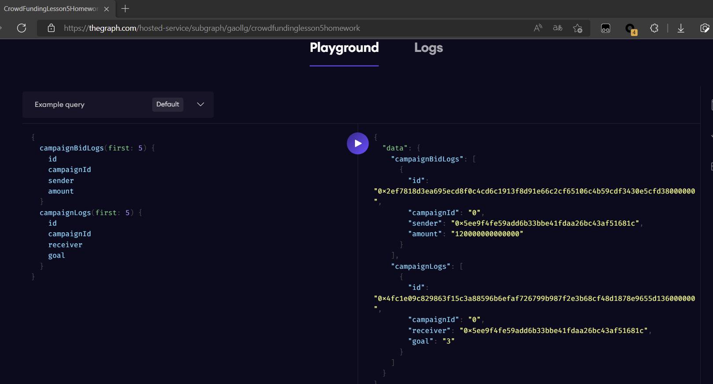

# tintin-lesson-5

```bash
graph init --product hosted-service gaollg/crowdfundinglesson5homework
cd crowdfundinglesson5homework
graph codegen 
graph build

graph auth --product hosted-service ********
graph deploy --product hosted-service gaollg/crowdfundinglesson5homework

```

### 作业1:请提供部署带有bid事件的合约地址。（3分）

> https://mumbai.polygonscan.com/address/0xad311c45cb7b3d29e4bad0ee97c2700d106c3753#code


#### 作业2:请提供部署的sungraph playgrpund地址。（3分）

> https://thegraph.com/explorer/subgraph/gaollg/crowdfundinglesson5homework

### 作业3:请使用sungraph完成一次合约bid事件的索引


